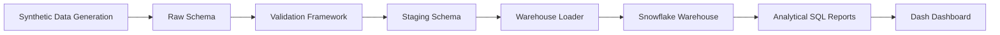

# Production-Inspired Data Engineering Pipeline for Visual Effects Analytics

<p align="center">


</p>

> **Project at a Glance**
>
> - 📊 **220,000+** synthetic production records processed
> - 🏗️ Three-layer ETL architecture (Raw → Staging → Warehouse)
> - 🧊 Snowflake dimensional data warehouse
> - 📈 40+ analytical SQL reports
> - 📉 5 interactive Dash dashboards
> - 🐍 Built with Python, PostgreSQL, SQLAlchemy, Pandas, and Plotly

---

## Overview

Modern Visual Effects (VFX) productions generate vast amounts of operational data across projects, sequences, shots, artists, task assignments, render farms, timesheets, and client deliveries. While these systems are optimized for production workflows, they are rarely designed for business intelligence or analytical reporting.

This project demonstrates how operational production data can be transformed into a centralized analytics platform through a production-inspired data engineering architecture.

The platform implements a production-inspired analytics pipeline using synthetic data generation, a multi-layer ETL architecture, dimensional data modeling, analytical SQL, and interactive dashboards, while emphasizing software engineering best practices, maintainability, and clear architectural boundaries.

This repository demonstrates the complete lifecycle of analytical data engineering.

---

# Why This Project?

During my experience working in Feature Film Visual Effects, I frequently worked with large production datasets used to coordinate artists, shots, simulations, render jobs, and deliveries.

Although these systems generated significant operational data, extracting meaningful production insights required combining information from multiple sources.

This project was built to simulate how a production data engineering team could design an analytics platform capable of transforming operational data into business-ready reporting.

The project intentionally mirrors many real-world engineering concepts, including:

- Layered ETL architecture
- Centralized data validation
- Dimensional warehouse modeling
- SQL-driven business logic
- Separation of data, business, and presentation layers
- Reusable dashboard components
- Modular Python package design

Rather than focusing on creating visually complex dashboards, the project prioritizes building a maintainable and scalable analytical platform.

---

# Dataset Overview

The repository generates a synthetic production dataset representing a medium-to-large Visual Effects studio.

| Dataset | Records |
|:---------|---------:|
| Artists | 300 |
| Projects | 10 |
| Sequences | 162 |
| Shots | 4,805 |
| Tasks | 18,624 |
| Task Assignments | 30,892 |
| Timesheets | 222,563 |
| Render Jobs | 7,016 |
| Deliveries | 8,261 |

The generated data intentionally models realistic production relationships while remaining entirely synthetic.

---

# Technology Stack

| Category | Technology |
|:----------|:-----------|
| Programming Language | Python 3.13+ |
| Database | PostgreSQL 18+ |
| Data Processing | Pandas |
| ORM | SQLAlchemy |
| Dashboard | Dash |
| Visualization | Plotly |
| Synthetic Data Generation | Faker |
| Warehouse Modeling | Snowflake Schema |

---

# Project Architecture

The platform follows a layered architecture where each component is responsible for a single concern.



The architecture deliberately separates operational data processing from business logic and presentation, allowing each layer to evolve independently.

---

# Data Warehouse Design

The analytical warehouse follows a **Snowflake Schema**, where dimension tables are normalized to reduce redundancy while maintaining clear relationships between production entities.

Unlike transactional schemas that prioritize write performance, the warehouse is optimized for reporting, aggregation, and analytical workloads.

The overall production hierarchy is modeled as:

```text
Project
   │
   ├── Sequence
   │      │
   │      └── Shot
   │               │
   │               ├── Tasks
   │               ├── Artists
   │               ├── Render Jobs
   │               └── Deliveries
```

This structure mirrors the hierarchy commonly found in Visual Effects production pipelines and allows analytics to be performed at multiple levels of granularity.

---

## Entity Relationship Diagram


---

## Why a Snowflake Schema?

Initially, the plan was to use a traditional Star Schema since it's one of the most common approaches for analytical databases. As the project evolved, however, I realized that the natural hierarchy of VFX production data made a Snowflake Schema a more suitable choice.

In a production environment, projects contain sequences, sequences contain shots, and almost every analytical query follows this hierarchy. Normalizing these entities allowed the warehouse to more accurately represent real production relationships while avoiding unnecessary duplication.

The decision was driven by several factors:

- The Project → Sequence → Shot hierarchy naturally lends itself to normalization.
- Production metadata is shared across thousands of downstream records, making normalization more storage-efficient.
- The design minimizes redundant data while preserving referential integrity.
- Hierarchical reporting becomes simpler and easier to maintain.
- The schema more closely reflects how production tracking systems are structured.

A Star Schema would still be a perfectly valid choice for many analytical workloads. However, for this project, a Snowflake Schema better represented the underlying production data while supporting the reporting requirements I wanted to build.

---

# ETL Pipeline

The platform follows a layered Extract–Transform–Load (ETL) architecture inspired by modern data engineering practices.

Each stage has a clearly defined responsibility.

```text
Synthetic CSV Data
        │
        ▼
    Raw Schema
        │
        ▼
 Validation Framework
        │
        ▼
  Staging Schema
        │
        ▼
 Warehouse Loader
        │
        ▼
 Snowflake Warehouse
```

Separating each stage allows transformations, validation rules, and warehouse loading logic to evolve independently without tightly coupling the pipeline.

---

## Stage 1 — Raw Layer

The Raw layer stores imported datasets exactly as they are generated.

Characteristics:

- No business transformations
- Minimal processing
- Source preservation
- Import validation
- Traceability

The purpose of this layer is to provide an immutable representation of the incoming source data before any transformations are applied.

---

## Stage 2 — Validation Framework

Before data progresses further into the pipeline, each dataset is validated against a centralized set of business rules.

Examples include:

- Missing primary keys
- Invalid foreign keys
- Null mandatory fields
- Duplicate identifiers
- Invalid numeric values
- Referential integrity violations

Invalid records are not silently discarded.

Instead, they are written to an **invalid log table**, allowing the pipeline to continue while preserving full visibility into rejected records.

This approach makes debugging significantly easier and mirrors practices commonly found in production ETL systems.

---

## Stage 3 — Staging Layer

The Staging layer performs the transformations required to prepare operational data for analytical workloads.

Typical responsibilities include:

- Data cleaning
- Data type conversion
- Foreign key resolution
- Standardization
- Normalization
- Preparing warehouse-ready datasets

Business calculations are intentionally kept minimal at this stage.

The primary objective is to produce clean, validated datasets that can be safely loaded into the warehouse.

---

## Stage 4 — Warehouse Loader

The Warehouse Loader transfers validated staging data into the dimensional warehouse.

Responsibilities include:

- Loading dimension tables
- Loading fact tables
- Maintaining referential integrity
- Executing warehouse verification checks

Once loaded, the warehouse becomes the single source of truth for all analytical reporting.

---

# Analytical SQL Layer

The warehouse exposes a collection of analytical SQL reports organized by business domain.

Current reporting domains include:

- Executive reporting
- Project metrics
- Production metrics
- Artist utilization
- Render analytics
- Delivery analytics

Each report is maintained as an independent SQL script, making the analytics layer modular, reusable, and easy to extend.

This design provides several advantages:

- Reports remain modular.
- Queries are easy to maintain.
- New dashboards can reuse existing SQL.
- Business logic remains centralized.

The dashboard never duplicates analytical calculations already performed within SQL.

---

# Dashboard Architecture

The dashboard is intentionally lightweight.

Rather than performing analytical calculations inside Python callbacks, it consumes pre-built SQL reports generated by the analytics layer.

```text
PostgreSQL
      │
      ▼
 Analytical SQL
      │
      ▼
 query_runner.py
      │
      ▼
 Pandas DataFrame
      │
      ▼
 Dash Callback
      │
      ▼
 Plotly Figure
      │
      ▼
 Browser
```

This keeps responsibilities clearly separated:

- SQL performs business analytics.
- Python orchestrates execution.
- Dash renders the presentation layer.
- Plotly handles visualization.

---

# Engineering Decisions

Several architectural decisions were intentionally made throughout the project.

## SQL Owns Business Logic

Business calculations, aggregations, KPIs, and reporting logic remain entirely inside SQL.

Python never calculates business metrics.

This ensures there is a single source of truth for analytical logic while simplifying dashboard maintenance.

---

## Presentation-Only Dashboard

The dashboard exists purely as a visualization layer.

Its responsibilities are limited to:

- Executing SQL
- Loading DataFrames
- Rendering charts
- Displaying tables

This separation greatly improves maintainability and makes analytical reports reusable outside of the dashboard.

---

## One Callback Per Dashboard Page

Instead of creating one callback for every KPI or chart, each dashboard page uses a single callback responsible for loading all required reports.

Benefits include:

- Fewer database queries
- Reduced callback complexity
- Better maintainability
- Improved performance

---

## Reusable Components

Common UI elements such as KPI cards, tables, charts, navigation, and footer components were abstracted into reusable modules.

This minimizes duplication while making future dashboard pages easier to implement.

---

## Absolute Imports

The dashboard is structured as a proper Python package using absolute imports throughout the project.

This improves readability, simplifies execution, and avoids issues commonly associated with relative imports in larger applications.

---

# Dashboard Walkthrough

The dashboard serves as the presentation layer of the platform. It consumes analytical SQL reports from the warehouse and visualizes them through interactive dashboards built with Dash and Plotly.

A key architectural decision throughout the project was to keep the dashboard free of business logic. All calculations, aggregations, and KPIs are performed within SQL, while Python is responsible only for executing queries and rendering the results.

---

## Executive Dashboard

The Executive Dashboard provides a high-level overview of studio-wide production metrics.

It includes:

- Studio KPIs
- Project status distribution
- Project type breakdown
- Budget allocation by project
- Task completion percentages


---

## Projects Dashboard

The Projects Dashboard focuses on project-level resource utilization and production workload.

It includes:

- Total projects
- Total tasks
- Total hours logged
- Total render hours
- Total deliveries
- Resource summary report


---

## Artists Dashboard

The Artists Dashboard provides insight into workforce utilization across departments.

It includes:

- Department utilization
- Total artists
- Average hours logged
- Largest department
- Department workload report


---

## Renders Dashboard

The Renders Dashboard monitors render farm performance and rendering workload.

It includes:

- Successful renders
- Failed renders
- Overall render success rate
- Total render jobs
- Render status distribution
- Render hours by project


---

## Deliveries Dashboard

The Deliveries Dashboard focuses on client delivery performance.

It includes:

- Delivery approval rate
- Approved deliveries
- Rejected deliveries
- Average client review time
- Deliveries by project


---

# Repository Structure

The repository is organized into independent modules, allowing each layer of the pipeline to evolve without impacting the others.

```text
vfx-production-analytics-platform/
│
├── analytics/
│   ├── artist_metrics/
│   ├── delivery_metrics/
│   ├── executive_dashboard/
│   ├── project_metrics/
│   └── render_metrics/
│   └── sequence_metrics/
│   └── task_metrics/
│   └── timesheet_metrics/
│
├── dashboard/
│   ├── assets/
│   ├── components/
│   ├── pages/
│   ├── app.py
│   ├── callbacks.py
│   └── query_runner.py
│
├── data/
│
├── data_generation/
│
├── database/
│
├── pipeline/
│   ├── load_raw.py
│   ├── transform.py
│   ├── load_warehouse.py
│   ├── validate.py
│   └── db.py
│
├── images/
│
├── README.md
├── LICENSE
├── requirements.txt
└── .gitignore
```

The folder organization intentionally mirrors the logical architecture of the platform, making it easier to navigate and extend.

---

# Installation

## Clone the Repository

```bash
git clone https://github.com/NoMoreBugzPlz/vfx-production-analytics-platform.git

cd vfx-production-analytics-platform
```

---

## Create a Virtual Environment

Windows

```bash
python -m venv venv

venv\Scripts\activate
```

Linux / macOS

```bash
python3 -m venv venv

source venv/bin/activate
```

---

## Install Dependencies

```bash
pip install -r requirements.txt
```

---

# Configuration

Create a `.env` file in the project root.

```env
DB_HOST=localhost
DB_PORT=5432
DB_NAME=vfx_database
DB_USER=postgres
DB_PASSWORD=your_password
```

Adjust the values according to your local PostgreSQL installation.

---

# Running the Project

The project should be executed from the repository root.

## Load Raw Data

```bash
python -m pipeline.load_raw
```

---

## Run Transformations

```bash
python -m pipeline.transform
```

---

## Load the Warehouse

```bash
python -m pipeline.load_warehouse
```

---

## Launch the Dashboard

```bash
python -m dashboard.app
```

The dashboard will be available at:

```text
http://127.0.0.1:8050/
```

---

# Development Principles

Several design principles guided the implementation of this project.

- Business logic remains entirely within SQL.
- Dashboard pages never perform analytical calculations.
- Reusable components minimize duplicated code.
- ETL stages remain independent.
- Validation is centralized.
- Absolute imports are used throughout the project.
- SQL reports are organized by business domain.
- Dashboard callbacks are grouped by page to reduce unnecessary database queries.

These principles were intentionally adopted to improve maintainability, scalability, and long-term extensibility.

---

# Future Roadmap

Although the current implementation provides a complete end-to-end analytical data engineering pipeline, there are several enhancements I've planned to further evolve the platform toward a production-grade cloud architecture.

## Phase 3 — Workflow Orchestration

The current ETL pipeline is executed manually. The next step is to orchestrate the pipeline using **Apache Airflow**, allowing individual stages to be scheduled, monitored, and retried independently.

Planned enhancements include:

- Apache Airflow DAGs
- Task dependency management
- Automated scheduling
- Failure notifications
- Incremental pipeline execution

---

## Phase 4 — Big Data Processing

The analytical SQL layer currently runs on PostgreSQL.

To simulate larger-scale production workloads, the transformation layer will be migrated to **Apache Spark**, enabling distributed processing for significantly larger datasets.

Planned improvements include:

- Apache Spark transformations
- Distributed analytical processing
- Performance comparisons between PostgreSQL and Spark
- Spark SQL implementations of existing reports

---

## Phase 5 — Cloud Deployment

The long-term objective is to deploy the platform using managed cloud services while preserving the existing architecture.

Potential deployment targets include:

- Google Cloud Platform
- Cloud SQL / PostgreSQL
- Compute Engine or Cloud Run
- Cloud Storage
- Secret Manager

This phase will focus on infrastructure rather than changes to the analytical design.

---

## Additional Enhancements

Additional enhancements under consideration include:

- Docker containerization
- CI/CD pipelines using GitHub Actions
- Automated testing
- Data quality monitoring
- Logging improvements
- Performance benchmarking
- Incremental warehouse loading
- Role-based dashboard authentication
- API endpoints for analytical reports

The overall architecture has been intentionally designed to support these additions without requiring significant structural changes.

---

# Challenges & Lessons Learned

Building this project involved much more than writing SQL queries or creating dashboards. Several architectural and implementation decisions evolved as the project grew in scope.

Some of the most valuable lessons included:

- Designing a layered ETL pipeline with clearly defined responsibilities.
- Building a centralized validation framework rather than validating data inside individual ETL scripts.
- Refactoring the warehouse from an initial Star Schema design to a Snowflake Schema that better reflected production relationships.
- Eliminating duplicate aggregations caused by fact-table fan-out in executive reports.
- Keeping business logic entirely within SQL while ensuring the dashboard remained presentation-focused.
- Refactoring the dashboard into a proper Python package using reusable components and absolute imports.
- Designing reusable callbacks that minimize redundant SQL execution and improve maintainability.

These decisions significantly improved the overall architecture and reinforced the importance of designing systems that are easy to extend rather than simply making them work.

---

# License

This project is licensed under the **GNU General Public License v3.0 (GPL-3.0)**.

See the [LICENSE](LICENSE) file for additional details.

---

# Author

## Jaydeep Das

**Data Engineer | Python Developer | Former CreatureFX Technical Director**

Experienced in designing Python automation, ETL pipelines, backend tooling, workflow optimization, and large-scale data processing within production Visual Effects pipelines.

This repository demonstrates the complete lifecycle of analytical data engineering through the design and implementation of a production-inspired analytics platform using modern data engineering principles.

**GitHub:** https://github.com/NoMoreBugzPlz

**LinkedIn:** www.linkedin.com/in/jaydeep-das-16b905213

---

# Acknowledgements

Although the production data used throughout this repository is entirely synthetic, the overall architecture and workflow are inspired by concepts commonly found in modern Visual Effects production environments.

This project was developed to explore and apply production-inspired data engineering practices, combining ETL design, dimensional modeling, analytical SQL, and interactive dashboards into a cohesive analytics platform.

---

⭐ If you found this project interesting, consider giving the repository a star.

Feedback and suggestions are always welcome.
