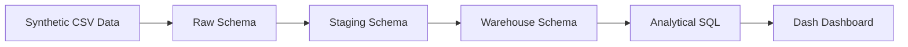
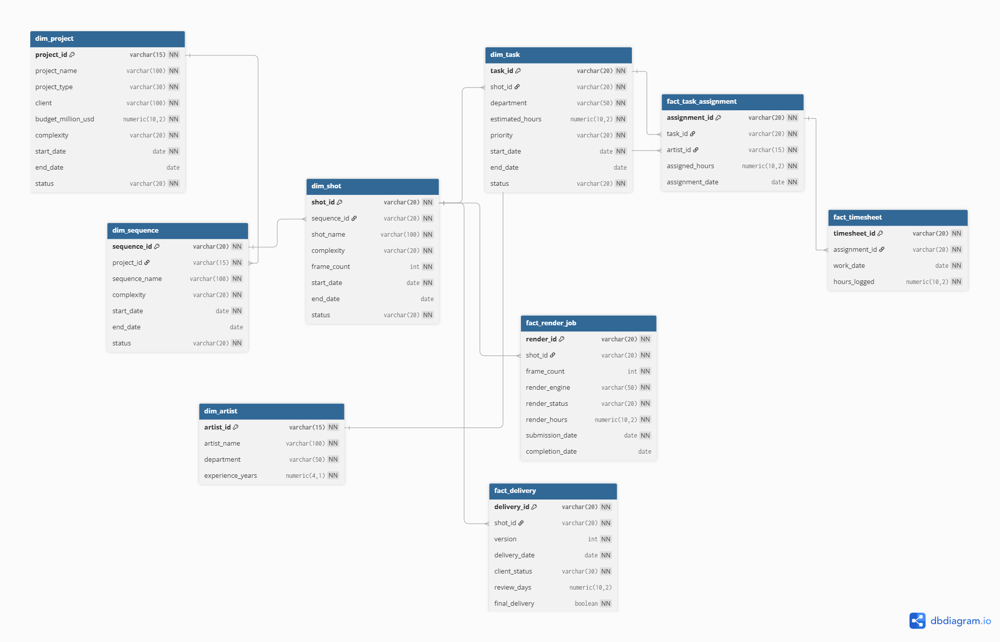
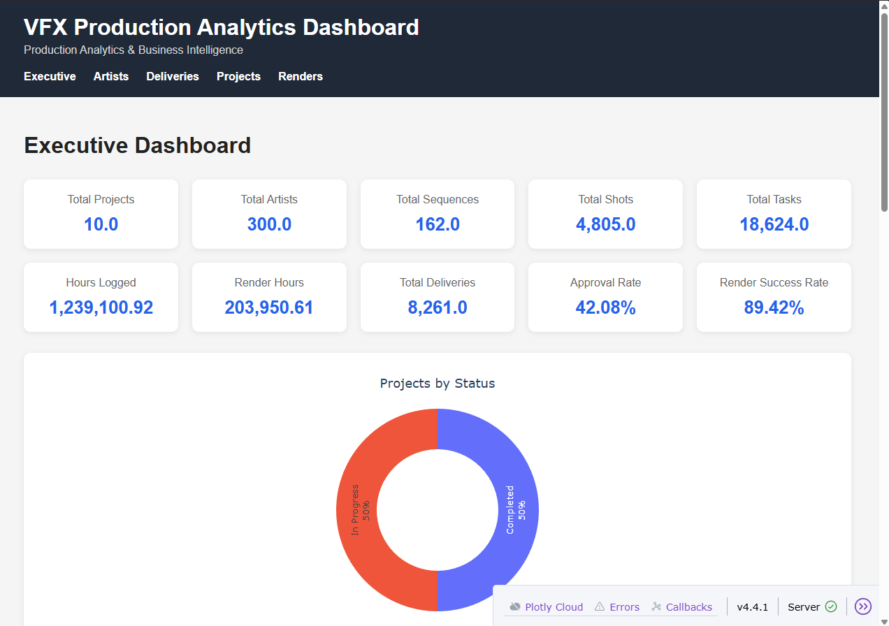
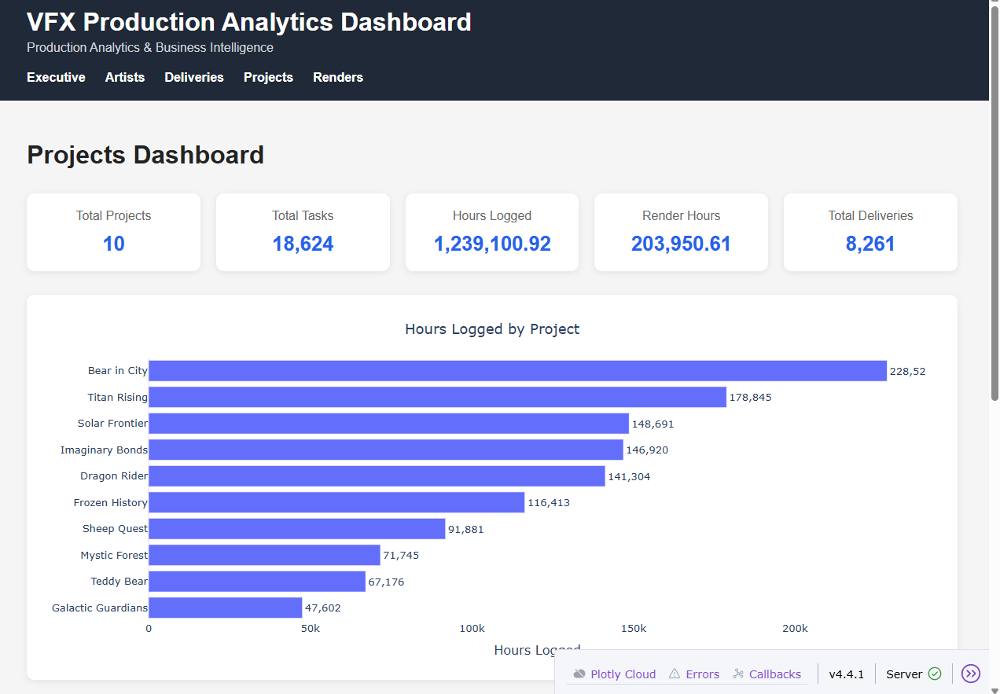
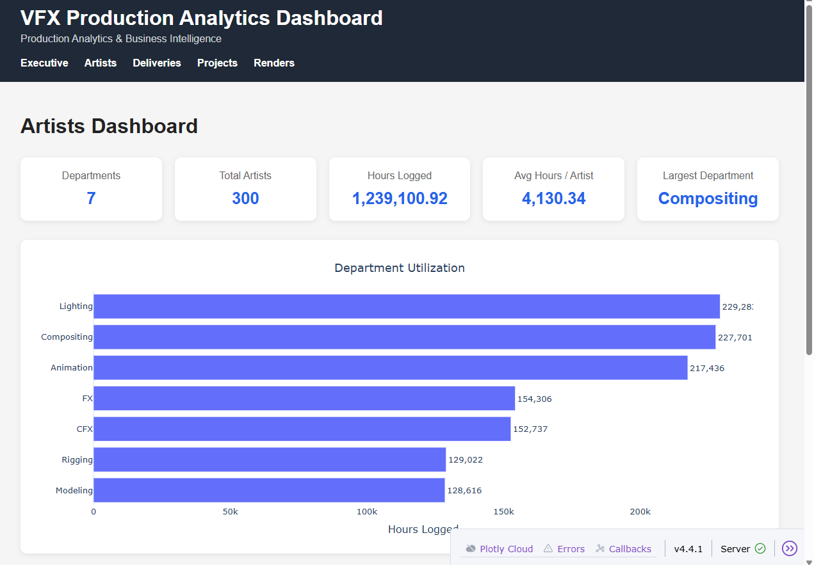
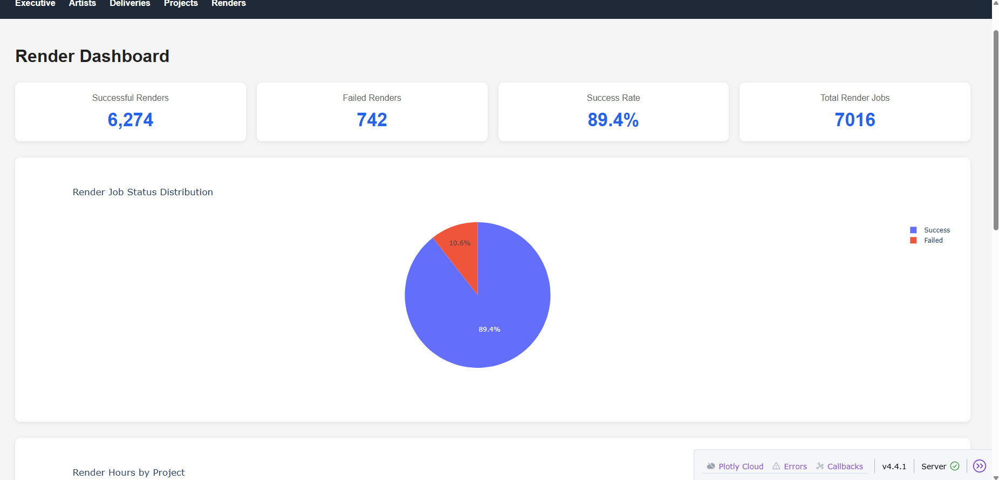
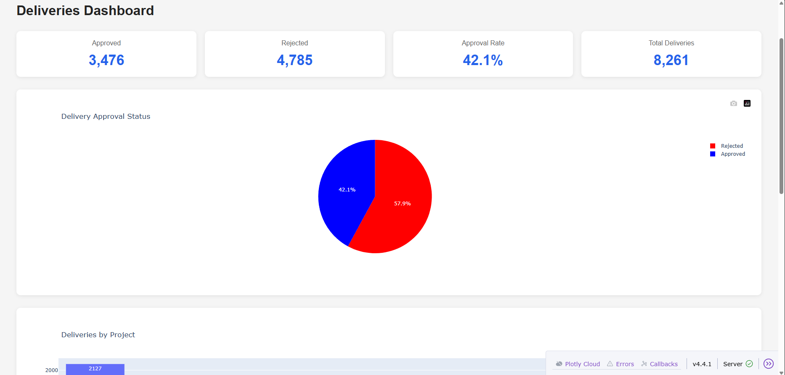

# Production-Grade Data Engineering Pipeline for Visual Effects Analytics


> A production-style data engineering project that models the end-to-end
> analytics lifecycle of a Visual Effects (VFX) studio using **Python**,
> **PostgreSQL**, **SQLAlchemy**, **Dash**, and a **Snowflake
> dimensional warehouse**.

------------------------------------------------------------------------

# Table of Contents

1.  Overview
2.  Why This Project?
3.  Features
4.  Current Project Status
5.  Technology Stack
6.  Architecture
7.  Dashboard
8.  Project Structure
9.  Installation
10. Running the Project
11. Design Principles
12. Roadmap
13. License

------------------------------------------------------------------------

# Overview

This project simulates a production-scale analytics platform for a VFX
studio. Operational datasets are generated, validated, transformed
through a layered ETL pipeline, loaded into a Snowflake warehouse,
queried using analytical SQL, and visualized through a lightweight Dash
dashboard.

The primary objective is to demonstrate production-oriented data
engineering practices rather than building a visually complex dashboard.

# Why This Project?

Modern VFX productions generate operational data across projects,
artists, sequences, shots, tasks, render farms, and deliveries.
Transactional systems are not optimized for business intelligence. This
project demonstrates how those operational datasets can be transformed
into analytics-ready data through clean architecture and engineering
best practices.

# Features

-   Synthetic production dataset generation
-   Raw → Staging → Warehouse ETL pipeline
-   Centralized validation framework
-   Snowflake dimensional warehouse
-   40+ analytical SQL reports
-   Interactive Dash dashboards
-   Reusable dashboard components
-   SQL-first analytics architecture
-   Modular Python package structure
-   Type hints and comprehensive docstrings

# Current Project Status

## ✅ Completed

### Data Generation

-   Synthetic VFX production dataset generation

### ETL Pipeline

-   Raw ETL
-   Staging ETL
-   Warehouse loader
-   Validation framework
-   Invalid row logging
-   Warehouse verification

### Data Warehouse

-   Snowflake dimensional model
-   Fact and dimension tables
-   Optimized indexes

### Analytics

-   40+ analytical SQL reports
-   Executive KPIs
-   Project analytics
-   Artist utilization
-   Production metrics
-   Render analytics
-   Delivery analytics

### Dashboard

-   Executive Dashboard
-   Projects Dashboard
-   Artists Dashboard
-   Renders Dashboard
-   Deliveries Dashboard
-   Reusable UI components
-   SQL-driven presentation layer

### Engineering

-   Modular package architecture
-   Absolute imports
-   Type hints
-   Docstrings
-   Clean separation of concerns

## 🚀 Next Phase

-   Apache Airflow
-   Docker
-   Apache Spark
-   Google Cloud Platform
-   dbt
-   CI/CD
-   Automated testing

# Technology Stack

| Category | Technology |
|:---------|:-----------|
| Programming Language | Python 3.13+ |
| Database | PostgreSQL 18+ |
| Data Processing | Pandas |
| ORM | SQLAlchemy |
| Dashboard | Dash |
| Visualization | Plotly |
| Synthetic Data Generation | Faker |
| Warehouse Modeling | Snowflake Schema |

# Project Architecture



## Data Warehouse ERD



# Dashboard

### Executive Dashboard



### Projects Dashboard



### Artists Dashboard



### Renders Dashboard



### Deliveries Dashboard



# Project Structure

``` text
analytics/
dashboard/
data/
images/
pipeline/
README.md
requirements.txt
LICENSE
```

# Installation

``` bash
git clone https://github.com/iSuckAtCodingStuff/vfx-production-analytics-platform.git
cd vfx-production-analytics-platform

python -m venv venv

# Windows
venv\Scripts\activate

pip install -r requirements.txt
```

# Running the Dashboard

``` bash
python -m dashboard.app
```

# Design Principles

-   Business logic belongs in SQL.
-   Python orchestrates ETL and presentation.
-   Dashboard performs no business calculations.
-   One callback per page.
-   Reusable components over duplication.
-   Clear separation of data, business, and presentation layers.

# Roadmap

**Phase 2** - Airflow orchestration - Docker

**Phase 3** - Spark - GCP - dbt - CI/CD

# License

Licensed under the **GNU General Public License v3.0**.

See the `LICENSE` file for details.

------------------------------------------------------------------------

# Author

**Jaydeep Das**

**Data Engineer | Python Developer | Former CreatureFX Technical Director**

Experienced in designing Python automation, ETL pipelines, backend tooling, workflow optimization, and large-scale data processing within production Visual Effects pipelines.

This repository showcases the design and implementation of a production-inspired analytics platform built using modern data engineering principles, including data modeling, ETL, analytical SQL, and interactive reporting.

GitHub: https://github.com/iSuckAtCodingStuff
